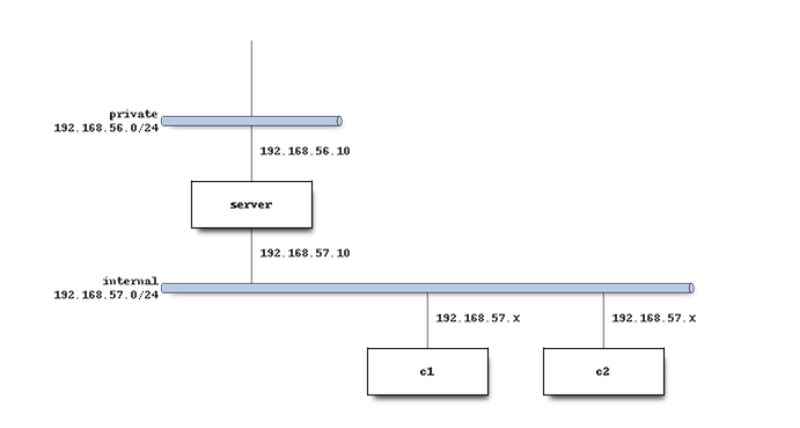

# Practice 1 -- DHCP Server Configuration

In this practice we will create a DHCP server and two clients using
Vagrant.\
The objective is that the clients will obtain the IP configuration
automatically from the server.



------------------------------------------------------------------------

**Authors:**\
Daniel Sánchez Cabello\
Pablo Corral Romera

**Course/Subject:** 2º ASIR B -- Network Services and Internet\
**Finish date:** 07/10/2025

------------------------------------------------------------------------

## Index

1.  [Vagrantfile creation and VM's network
    configuration](#1-vagrantfile-creation-and-vms-network-configuration)
    1.  [Server creation](#11-server-creation)
    2.  [Client 1 creation](#12-client-1-creation)
    3.  [Client 2 creation](#13-client-2-creation)
2.  [Provision files](#2-provision-files)
    1.  [Provision for the server](#21-provision-for-the-server)
    2.  [Provision for the clients](#22-provision-for-the-clients)
3.  [Execution of the Vagrantfile and network
    checks](#3-execution-of-the-vagrantfile-and-network-checks)
    1.  [Execution of the
        Vagrantfile](#31-execution-of-the-vagrantfile)
    2.  [Network check](#32-network-check)

------------------------------------------------------------------------

## 1. Vagrantfile Creation and VM's Network Configuration

### 1.1 Server Creation

The first step is to tell Vagrant the box that we will use, in this case
`debian/bullseye64`.

Then we create the first VM called **server** and configure two network
interfaces:

-   **Private network** -- `192.168.56.10` → to get a host-only
    communication with our real computer.\
-   **Internal network** -- `192.168.57.10` → to communicate with the
    two clients that will be isolated from our computer.

After that, we must add the provision path. In that provision we will
set further configurations.

------------------------------------------------------------------------

### 1.2 Client 1 Creation

Now, let's create the first client called **c1**.\
This one will receive the IP from the server given a range of IPs
(`192.168.57.25 – 192.168.57.50`).\
That means that inside that range, it can receive any IP that is free
from the server.

We must also configure the network as an internal network and specify
that it will receive the IP through DHCP.\
Also, set the path for the provision file.

------------------------------------------------------------------------

### 1.3 Client 2 Creation

For the other client (**c2**), the process will be the same except for a
detail:\
the IP address it receives will be **fixed by MAC**, which means that we
will indicate its MAC address and the server will always give the same
IP to that MAC.

Add the path for the provision too (it is the same for c1 and c2).

------------------------------------------------------------------------

## 2. Provision Files

### 2.1 Provision for the Server

File: `provision_server.sh`

``` bash
#!/bin/bash

# Paramos si falla algun comando para verlo
set -e

# Mensaje por pantalla y parametro -y para evitar necesidad de confirmacion
echo "Instalando servidor DHCP..."
apt update -y
# Instalamos el dhcp y las herramientas necesarias
apt install -y isc-dhcp-server net-tools iproute2

# Interfaz donde escuchará el servicio (la red interna)
#Obtener el nombre de la interfaz (Mostrar las interfaces)
INTERFACE=$(ip -o -4 addr show | awk '/192\.168\.57\./ {print $2}')
#Modifica el servicio DHCP donde añade a la configuración el valor de $INTERFACE
sed -i "s/^INTERFACESv4=.*/INTERFACESv4=\"$INTERFACE\"/" /etc/default/isc-dhcp-server

# Copia de seguridad del archivo de configuración por si es necesaria
cp /etc/dhcp/dhcpd.conf /etc/dhcp/dhcpd.conf.bak

# Configuración del servicio DHCP
cat > /etc/dhcp/dhcpd.conf <<EOF
default-lease-time 86400;
max-lease-time 691200;
authoritative;

subnet 192.168.57.0 netmask 255.255.255.0 {
  range 192.168.57.25 192.168.57.50;
  option routers 192.168.57.10;
  option broadcast-address 192.168.57.255;
  option domain-name-servers 8.8.8.8, 4.4.4.4;
  option domain-name "micasa.es";
}

# Cliente c2 - IP fija por MAC
host c2 {
  hardware ethernet 08:00:27:aa:bb:cc;
  fixed-address 192.168.57.31;
  option domain-name-servers 1.1.1.1;
  default-lease-time 3600;
}
EOF

# Reiniciar y habilitar servicio
systemctl restart isc-dhcp-server
systemctl enable isc-dhcp-server

# Comprobamos estado del servicio y evitamos salida paginada para automatizar
echo "Comprobando estado del servicio..."
systemctl status isc-dhcp-server --no-pager
```

------------------------------------------------------------------------

### 2.2 Provision for the Clients

File: `provision_client.sh`

``` bash
#!/bin/bash
# Detenemos la ejecución si falla algún comando
set -e

# Actualizamos e instalamos el cliente DHCP y las herramientas de red
apt update -y
apt install -y net-tools iproute2 isc-dhcp-client

# Mostramos mensaje de que todo ha ido bien y verificamos la configuración IP
echo "Configuración de cliente lista."
dhclient -v
ip a
```

------------------------------------------------------------------------

## 3. Execution of the Vagrantfile and Network Checks

### 3.1 Execution of the Vagrantfile

Once everything (Vagrantfile and provisions) is ready, use the command:

``` bash
vagrant up
```

to create the VMs with the configuration we established.

Be aware of possible errors in the command line.\
If there are no errors, we can continue to the next step.

------------------------------------------------------------------------

### 3.2 Network Check

Connect via SSH to the three VMs and use `ip a` to verify that all the
IPs are correct.

First, check the IP of **server** and the connectivity with our physical
machine and with the two clients:

``` bash
vagrant ssh server
ip a
```

Use `logout` to exit the machine and do the same in **c1** and **c2**.

------------------------------------------------------------------------

#### Ping Tests

-   Server to physical machine\
-   Server to c1 and c2\
-   c1 to c2\
-   c1 to Google\
-   Physical machine to server and c2 (the c2 ping should fail)

Example outputs:

``` bash
vagrant@c1:~$ ping -c 5 8.8.8.8
5 packets transmitted, 5 received, 0% packet loss, time 4674ms
rtt min/avg/max/mdev = 17.999/52.489/118.158/42.324 ms
```

``` bash
vagrant@c1:~$ ping -c 3 192.168.57.31
3 packets transmitted, 3 received, 0% packet loss
rtt min/avg/max/mdev = 0.359/0.401/0.437/0.032 ms
```

``` bash
vagrant@server:~$ ping -c 3 192.168.57.25
3 packets transmitted, 3 received, 0% packet loss
rtt min/avg/max/mdev = 0.262/0.291/0.316/0.022 ms
```

``` bash
vagrant@server:~$ ping -c 3 192.168.57.31
3 packets transmitted, 3 received, 0% packet loss
rtt min/avg/max/mdev = 0.299/0.315/0.326/0.011 ms
```

------------------------------------------------------------------------

### Vagrantfile 

``` ruby
# -*- mode: ruby -*-
# vi: set ft=ruby :

Vagrant.configure("2") do |config|
  config.vm.box = "debian/bullseye64"

  # Server
  config.vm.define "server" do |server|
    server.vm.hostname = "server"
    # Adapter 1: Private network
    server.vm.network "private_network", ip: "192.168.56.10"
    # Adapter 2: Internal network (DHCP)
    server.vm.network "private_network",
      ip: "192.168.57.10",
      virtualbox__intnet: "intNet1",
      auto_config: true
    # Provision script
    server.vm.provision "shell", path: "provision/provision_server.sh"
  end

  # Client 1
  config.vm.define "c1" do |c1|
    c1.vm.hostname = "c1"
    c1.vm.network "private_network",
      virtualbox__intnet: "intNet1",
      type: "dhcp"
    c1.vm.provision "shell", path: "provision/provision_client.sh"
  end

  # Client 2
  config.vm.define "c2" do |c2|
    c2.vm.hostname = "c2"
    c2.vm.network "private_network",
      mac: "080027AABBCC", # Fixed MAC address
      virtualbox__intnet: "intNet1",
      type: "dhcp"
    c2.vm.provision "shell", path: "provision/provision_client.sh"
  end
end
```

------------------------------------------------------------------------

### Example `ip a` Outputs

``` bash
3: eth1: <BROADCAST,MULTICAST,UP,LOWER_UP> mtu 1500 qdisc pfifo_fast state UP group default qlen 1000
link/ether 08:00:27:9e:bb:85 brd ff:ff:ff:ff:ff:ff
inet 192.168.57.25/24 brd 192.168.57.255 scope global dynamic eth1
inet6 fe80::a00:27ff:fe9e:bb85/64 scope link
valid_lft forever preferred_lft forever
```

------------------------------------------------------------------------

**End of Document**\
© Daniel Sánchez Cabello & Pablo Corral Romera
